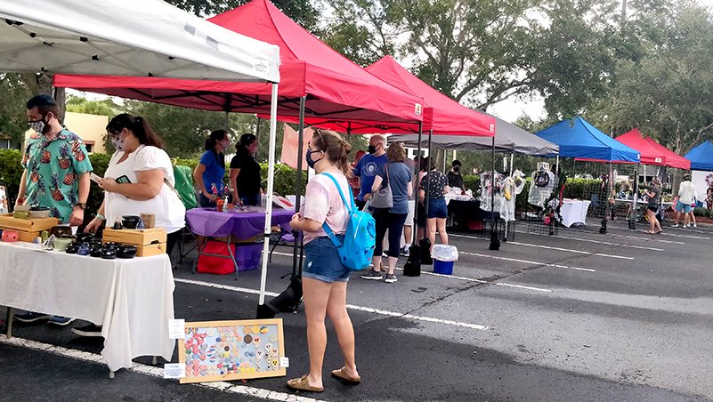
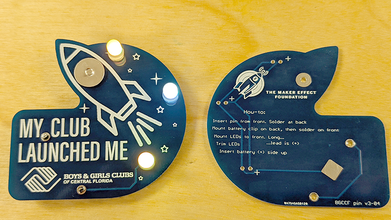
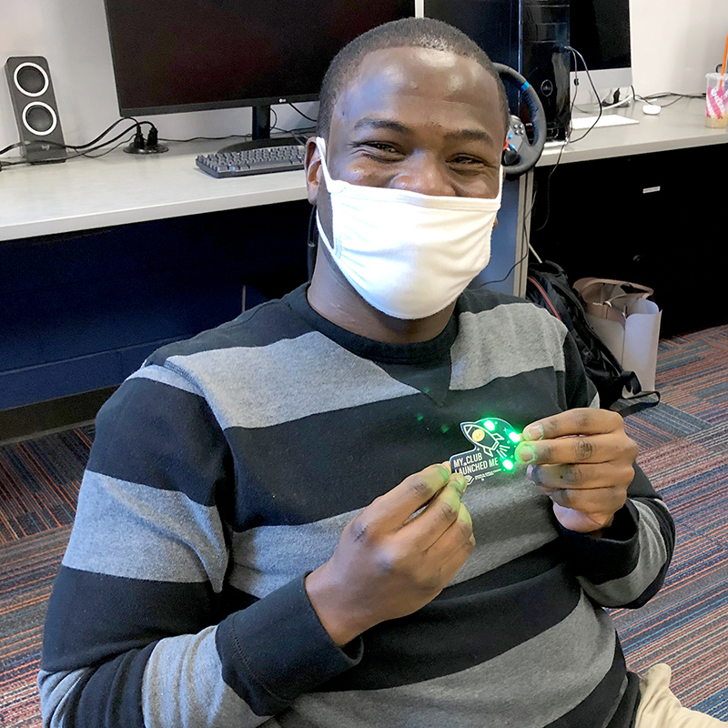

<section class="Maker Faire in 2020">
  

    

      

        <h2>Maker Faire Orlando 2020</h2>
        

        

        

        

        
2020 has been a year of unprecedented challenges that have affected all facets of life including our maker events and gatherings.
        The Maker Faire Orlando team is heartbroken that were not able to gather together for our annual tradition, but that didn't stop our maker spirit!

         
        
We've followed your posts, watching you make in your home studios, workshops and in your local makerspaces. <a href="https://orlandofightscovid.com/">We worked together to create PPE alternatives</a> during the early months of the pandemic, and we've seen those impacted by furloughs and layoffs starting maker business, opening Etsy shops, and creating in entirely new ways. We continue to be inspired by the resolve and your spirit of the maker community!
        <ul>
        <li>We hosted several small Pop-Up Maker Faire events around Orlando during 2020, and participated in the <a href="https://www.facebook.com/events/1031440747333061">"Maker Takeover at Orlando Science Center"</a> in December. The October Pop-up event featured Disney Cast Members <a href="https://flic.kr/s/aHsmSqFVfw">(pictures)</a> that had been furloughed, and it was great to meet these amazing makers, hear their stories and to purchase their awesome creations.   
        

         We enjoyed this "Pop-up" event formula and will continue these small events in 2021. <a href="https://www.facebook.com/makerfaireorlando">Follow us on Facebook</a> or <a href="http://eepurl.com/bpCB8T">subscribe to our email newsletter</a> to stay informed! If your organization would like to host one of these small events, <a href="mailto:makers@makerfaireorlando.com">please email us to discuss.</a></li> 
        <li>We launched a new participative art project called <a href="https://www.facebook.com/brightbikesorl">"BrightBikes"</a> which includes a fleet of LED-covered art bikes with music and interactive graphics created by local interactive artists as well as tips and tricks to add LEDs to your bike!
          

        <iframe width="560" height="315" src="https://www.youtube.com/embed/R5WS32tsVmU" frameborder="0" allow="accelerometer; autoplay; clipboard-write; encrypted-media; gyroscope; picture-in-picture" allowfullscreen></iframe>
          
        <iframe width="560" height="315" src="https://www.youtube.com/embed/_E--rsD7uEI" frameborder="0" allow="accelerometer; autoplay; clipboard-write; encrypted-media; gyroscope; picture-in-picture" allowfullscreen></iframe>
            
        <iframe src="https://giphy.com/embed/k93bPqzXO9m5b2PXl6" width="560" height="315" frameBorder="0" class="giphy-embed" allowFullScreen></iframe>

         <a href="https://www.facebook.com/brightbikesorf">Follow BrightBikes on Facebook</a> or <a href="http://eepurl.com/bpCB8T">subscribe to our email newsletter</a> to stay informed and to get involved! If your organization would like to host the bikes at your location or rent the bikes for an event, <a href="mailto:makers@makerfaireorlando.com">please email us to discuss.</a></li> 

        <li>Since we could not teach soldering at Maker Faire Orlando in 2020, we created a partnership program with Boys & Girls Clubs of Central Florida. Kids in the Orange County clubs are now making an awesome LED badges right in their community clubhouse!  
        

 
        

        A Boys & Girls Clubs of Central Florida staff member makes the first badge during training!
        </li> 

        <li>We tested a small-format, socially-distanced <a href="https://robotruckus.org">Robot Ruckus</a> event ("R5") in December to great feedback. You can see the event and be notified of future streams over on the <a href="https://www.twitch.tv/robotruckus">Robot Ruckus Twitch</a> We will continue these smaller events (live-streamed with no spectators) in 2021. Watch the <a href="https://www.robotruckus.org">Robot Ruckus website</a> or the <a href="https://www.facebook.com/robotruckus">Robot Ruckus page on Facebook</a> for more information.</li> 

        <li>Unfortunately we were not able to host a <a href="/power-racing">Power Racing Series</a> event this fall due to schedule conflicts with the competitors. We hope to be able to schedule an exhibition race in Q1 of 2021 which will be live streamed (no in-person spectators). If you want to build a new racer and to get into the competition - <a href="mailto:powerracing@makerfaireorlando.com">email us for more info!</a></li> 
        </ul>
        

        
Stay tuned to the Maker Faire Orlando social channels and to our <a href="http://eepurl.com/bpCB8T">email newsletter</a> for news and updates!

      

    

  

</section>
